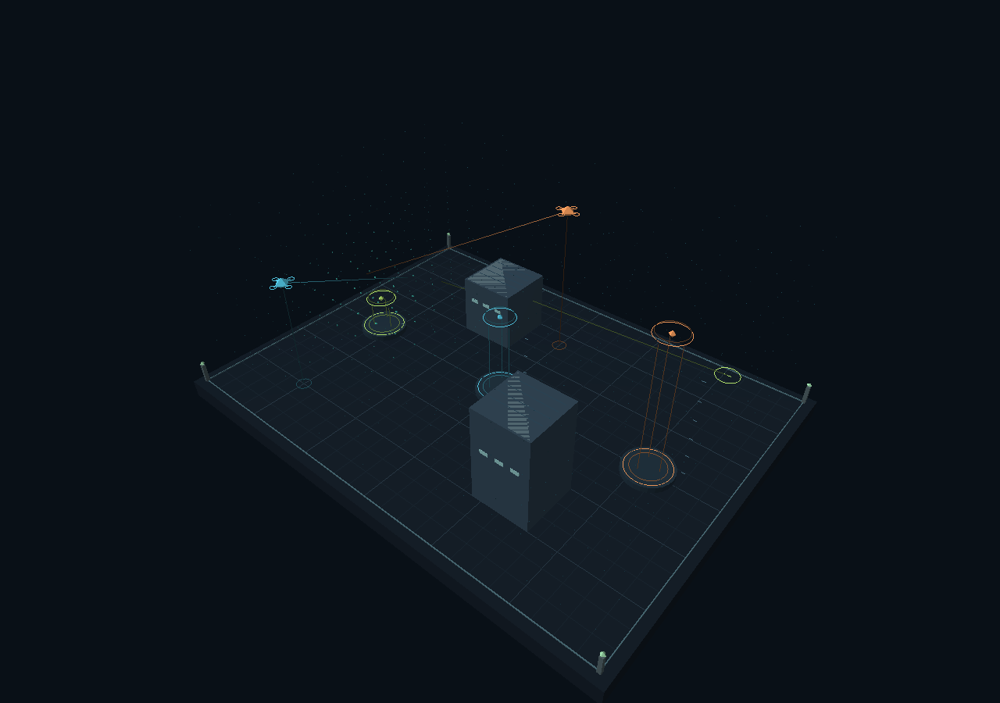

# Archimedes World 3D

**Version 0.2.0 · September 30, 2026 · Matthew Chenoweth Wright / Monolithic LLC**

A small, executable 3D research world: three flying agents, a volumetric scalar field, solid buildings, gravity probes, recursive future search, source counterfactuals, and branching session history. Implementation and documentation developed with OpenAI Codex assistance.

## Open the simulator

Open **`Archimedes-World3D.html`** from the repository root for the self-contained app. Or serve the repository and visit **`/world3d/`**:

```bash
python3 -m http.server 8000
```

Open `http://localhost:8000/world3d/`. No API key, install, CDN, external model, remote font or account is needed. A WebGL-capable browser is required. When viewing an HTML download through a service that does not execute scripts, download it and open the local file in a browser.

The original two-dimensional laboratory remains at `/`. A link there opens the 3D world. The two kernels and save formats are separate; 2D sessions continue to work in the original laboratory.

## First experiment

1. **Run world.** ADA, NOETHER and HYPATIA move through all three spatial coordinates.
2. Click an agent or its inspector tab. Compare actual coordinates with the agent's internal estimate.
3. Inject a **Field pulse**, then **Blind sensors**. Only field observations are interrupted; own position and energy remain observed.
4. Press **Explore futures**. The world pauses; three candidate sequences appear. Select one to display its dashed 3D paths, then apply its first intention.
5. Restore a checkpoint and choose another intervention. The previous unsaved continuation is checkpointed before the rewind.
6. **Drop probe** to observe gravity, floor bounce and building contact.
7. Set memory coupling to zero to compare against the model without the recursive restoring force.
8. Export the JSON session. Browser autosave is best-effort; the exported file is portable.

## Camera controls

| View | Controls |
| --- | --- |
| Orbit | Drag to orbit; wheel or two-finger pinch to zoom; Shift-drag or right-drag to pan |
| Follow agent | Tracks the selected agent while retaining orbit and zoom |
| Enter world | Drag to look; focus the world, then W/A/S/D to move and Q/E to descend/ascend; camera is kept outside the two buildings |
| Top | Near-vertical overview, with orbit and zoom available |
| All | Recenter returns to the default orbit; Space plays/pauses when the world has keyboard focus |

Touch users can orbit, pinch-zoom, select agents, and use all experiment controls. First-person translation currently requires a keyboard. The camera does not affect simulation dynamics.

## What is simulated

| Component | Implemented behavior |
| --- | --- |
| Space | 24 × 10 × 18 simulation units; 16 × 6 × 12 field cells |
| Agents | Three bounded, inertia-driven spheres with 3D positions and velocities; finite-state target policies |
| Field | Six-neighbor source–diffusion–decay update; reflecting outer boundary; buildings do not block field diffusion |
| Estimates | Five normalized features: three coordinates, energy and sensed field; exponential observer |
| Recursive feedback | Coherence, signed divergence, alignment surrogate and bounded order parameter; memory force affects motion |
| Contacts | Agent/building/boundary projection; gravity-probe/building/floor/boundary restitution |
| Planning | Four actions, beam width 3 in the UI, up to four decisions; full simulated-state access |
| Counterfactual | Paired 6-second rollouts with the source state toggled in one branch |
| History | Up to 32 full snapshots with parent pointers, PRNG state and validated JSON import/export |

Station rings are **non-solid waypoints**. Agents and probes do not collide with each other. Decorative lines and rings are not physical bodies. There is no terrain editor, chemistry, optics, wave equation, quantum dynamics, multi-room streaming or multiplayer in this release. Those need separate model contracts and tests.

## Inspect and reproduce

- [Mathematics and update order](MATHEMATICS.md)
- [Validation and remaining limits](VALIDATION.md)
- [Build/source provenance](PROVENANCE.md)

From the repository root:

```bash
npm test
npm run build
npm run package
```

Node 22 or later. No npm dependencies. `npm run package` writes a complete ZIP beside the repository. `npm run experiment:3d` regenerates a small seeded developmental comparison. `python3 scripts/render-world3d.py` optionally compiles the actual graphics shaders and renders an offscreen scene using Python/Pillow and Mesa EGL. The latter is a graphics check, not a browser UI test.



This image uses the shipped geometry and shaders at simulation tick 80. It is a scene capture, not a browser screenshot or a generated concept image.

## GitHub Pages

The existing Pages workflow now tests and builds before uploading `dist/`. After this branch is merged and that workflow succeeds, the 3D route is:

`https://enuminous.github.io/Archimedes-Engine/world3d/`

The route is not a claim of an already completed deployment. Under Settings → Pages, the source must be **GitHub Actions** for that workflow to publish. Branch/root Pages is also compatible with the committed static files. See [GitHub's custom Pages workflow documentation](https://docs.github.com/en/pages/getting-started-with-github-pages/using-custom-workflows-with-github-pages).

## Evidence boundary

This is a functioning computational prototype with declared approximations. It extends the v0.1.0 adaptation, not the entire canonical Monolithic corpus. Its field is diffusion, not the EFMW root wave equation. Agreement between a simulated agent and its own estimate does not establish physical EFMW validity, consciousness, AGI or predictive ability about a person. The [existing rights notice](../RIGHTS.md) applies; this release does not grant a new license.
